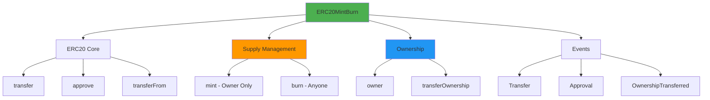
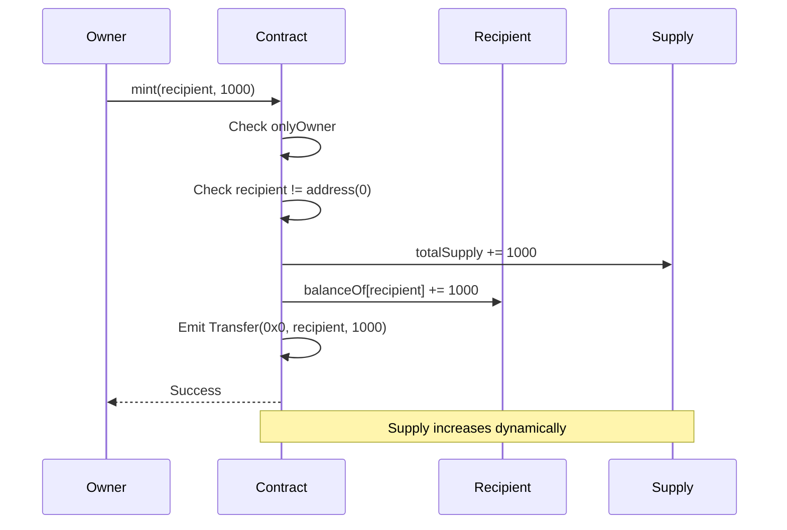
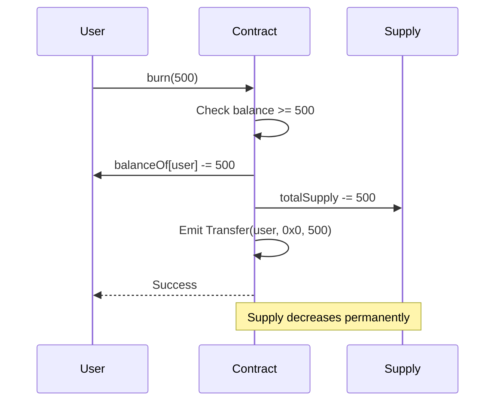
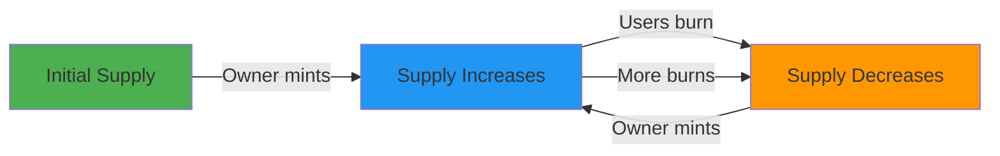
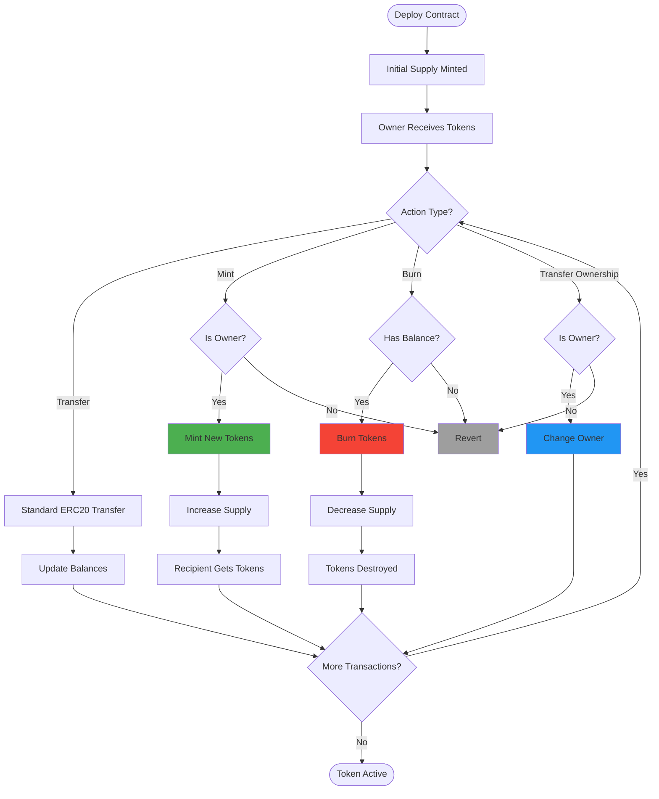
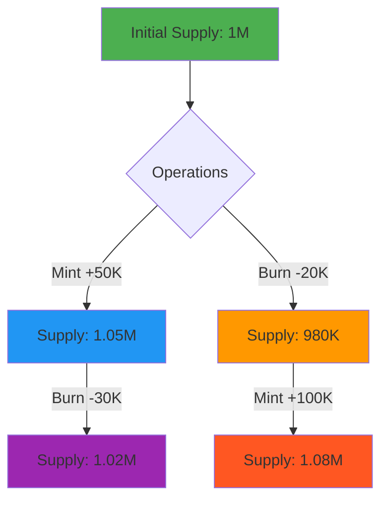

# ERC20 MintBurn Token

<div align="center">
  <a href="https://docs.soliditylang.org/en/v0.8.20/"></a>
  <a href="https://hardhat.org/"></a>
  <a href="https://opensource.org/licenses/MIT"></a>
  <a href="https://hardhat.org/hardhat-network/docs"></a>
  <a href="https://eips.ethereum.org/EIPS/eip-20"></a>
  <a href="https://ethereum.org/"></a>
</div>

<div align="center">
  <h3>Advanced ERC20 token with mint, burn, and ownership features</h3>
  <p>Full-featured token implementation with dynamic supply management and access control</p>
  
  <br>
  
  <a href="#overview">Overview</a> •
  <a href="#features">Features</a> •
  <a href="#getting-started">Getting Started</a> •
  <a href="#deployment">Deployment</a> •
  <a href="#usage-examples">Usage</a> •
  <a href="#mint--burn">Mint & Burn</a> •
  <a href="#author">Author</a>
  
  <br><br>
  
  
  
  
</div>

---

## Table of Contents

- [Overview](#overview)
- [Features](#features)
- [Architecture](#architecture)
- [Mint & Burn Mechanism](#mint--burn-mechanism)
- [Workflow](#workflow)
- [Getting Started](#getting-started)
- [Contract Details](#contract-details)
- [Deployment](#deployment)
- [Usage Examples](#usage-examples)
- [Security Features](#security-features)
- [Use Cases](#use-cases)
- [Author](#author)

---

## Overview

ERC20MintBurn is an enhanced ERC20 token implementation that adds dynamic supply management through mint and burn functions, plus transferable ownership. Perfect for tokens that need flexible supply control like stablecoins, reward tokens, or governance tokens with burning mechanisms.

### Key Highlights

- **Full ERC20 Compliance**: All standard functions implemented
- **Mintable**: Owner can create new tokens
- **Burnable**: Anyone can burn their own tokens
- **Ownable**: Transferable ownership control
- **Dynamic Supply**: Total supply adjusts with mint/burn
- **18 Decimals**: Standard precision
- **Event-Driven**: Complete audit trail

---

## Features

| Feature | Description |
|---------|-------------|
| **ERC20 Standard** | Transfer, approve, transferFrom |
| **Mint Tokens** | Owner can create new tokens |
| **Burn Tokens** | Users can destroy their tokens |
| **Ownership Transfer** | Change contract owner |
| **Access Control** | Owner-only mint function |
| **Dynamic Supply** | Supply changes with mint/burn |
| **Balance Validation** | Prevents invalid operations |

---

## Architecture

<div align="center">



</div>

### Contract Structure

```
ERC20MintBurn
├── ERC20 Core
│   ├── name, symbol, decimals
│   ├── totalSupply, balanceOf, allowance
│   ├── transfer()
│   ├── approve()
│   └── transferFrom()
├── Supply Management
│   ├── mint() - onlyOwner
│   └── burn() - anyone
├── Ownership
│   ├── owner
│   ├── onlyOwner modifier
│   └── transferOwnership()
└── Events
    ├── Transfer
    ├── Approval
    └── OwnershipTransferred
```

---

## Mint & Burn Mechanism

### How Minting Works

<div align="center">



</div>

### How Burning Works

<div align="center">



</div>

### Supply Dynamics

<div align="center">



</div>

---

## Workflow

### Complete Token Lifecycle

<div align="center">



</div>

---

## Getting Started

### Prerequisites

- Node.js v16+
- npm or yarn
- Git
- Hardhat
- ETH for deployment (if deploying to testnet/mainnet)

### Installation

```bash
# Clone repository
git clone https://github.com/Siddheshwar-cloud/erc20-mintburn.git
cd erc20-mintburn

# Install dependencies
npm install
```

### Project Structure

```
erc20-mintburn/
├── contracts/
│   └── ERC20MintBurn.sol
├── scripts/
│   └── deploy.js
├── hardhat.config.js
└── README.md
```

---

## Contract Details

### State Variables

```solidity
string public name;               // Token name
string public symbol;             // Token symbol
uint8 public decimals = 18;      // Decimal places
uint256 public totalSupply;      // Dynamic total supply
address public owner;            // Contract owner

mapping(address => uint256) public balanceOf;                    // User balances
mapping(address => mapping(address => uint256)) public allowance; // Spending allowances
```

---

### Constructor

```solidity
constructor(
    string memory _name,
    string memory _symbol,
    uint256 _initialSupply
)
```

**Parameters:**
- `_name`: Token name (e.g., "MintBurnToken")
- `_symbol`: Token symbol (e.g., "MBT")
- `_initialSupply`: Initial supply without decimals

**Effects:**
- Sets token metadata
- Sets deployer as owner
- Mints initial supply to deployer

---

### Modifiers

#### onlyOwner

```solidity
modifier onlyOwner()
```

Restricts function access to contract owner only.

**Usage:**
```solidity
function mint(address _to, uint256 _amount) external onlyOwner { ... }
```

---

### Functions

#### ERC20 Core Functions

These functions are identical to standard ERC20:

- `transfer(address _to, uint256 _value)`
- `approve(address _spender, uint256 _value)`
- `transferFrom(address _from, address _to, uint256 _value)`

---

#### mint()

```solidity
function mint(address _to, uint256 _amount) external onlyOwner
```

Creates new tokens and assigns them to an address. **Owner only.**

**Parameters:**
- `_to`: Recipient address
- `_amount`: Amount to mint (without decimals)

**Requirements:**
- Caller must be owner
- Recipient must not be zero address

**Effects:**
- Increases `totalSupply`
- Increases recipient's balance
- Emits `Transfer` event from address(0)

**Example:**
```javascript
await token.mint(recipientAddress, 10000); // Mints 10,000 tokens
```

---

#### burn()

```solidity
function burn(uint256 _amount) external
```

Destroys tokens from caller's balance. **Anyone can burn their own tokens.**

**Parameters:**
- `_amount`: Amount to burn (without decimals)

**Requirements:**
- Caller must have sufficient balance

**Effects:**
- Decreases caller's balance
- Decreases `totalSupply`
- Emits `Transfer` event to address(0)

**Example:**
```javascript
await token.burn(500); // Burns 500 tokens
```

---

#### transferOwnership()

```solidity
function transferOwnership(address _newOwner) external onlyOwner
```

Transfers contract ownership to a new address.

**Parameters:**
- `_newOwner`: Address of new owner

**Requirements:**
- Caller must be current owner
- New owner must not be zero address

**Effects:**
- Changes `owner` to `_newOwner`
- Emits `OwnershipTransferred` event

**Example:**
```javascript
await token.transferOwnership(newOwnerAddress);
```

---

### Events

#### Transfer

```solidity
event Transfer(address indexed from, address indexed to, uint256 value)
```

Emitted for transfers, mints (from=0x0), and burns (to=0x0).

---

#### Approval

```solidity
event Approval(address indexed owner, address indexed spender, uint256 value)
```

Emitted when allowance is set.

---

#### OwnershipTransferred

```solidity
event OwnershipTransferred(address indexed oldOwner, address indexed newOwner)
```

Emitted when ownership changes.

---

## Deployment

### Local Network

```bash
# Terminal 1: Start node
npx hardhat node

# Terminal 2: Deploy
npx hardhat run scripts/deploy.js --network localhost
```

### Testnet Deployment (Sepolia)

```bash
# Ensure you have Sepolia ETH
npx hardhat run scripts/deploy.js --network sepolia
```

### Deployment Script Features

The deploy script includes:
- Balance checking (minimum 0.001 ETH required)
- Account information logging
- Deployment confirmation
- Error handling with helpful messages

### Deployment Output

```
Deploying with account: 0xf39Fd6e51aad88F6F4ce6aB8827279cffFb92266
Account balance: 10000.0 ETH
ERC20MintBurn deployed to: 0x5FbDB2315678afecb367f032d93F642f64180aa3
```

---

## Usage Examples

### Complete Token Example

```javascript
const { ethers } = require("hardhat");

async function main() {
  // Deploy
  const Token = await ethers.getContractFactory("ERC20MintBurn");
  const token = await Token.deploy("MintBurnToken", "MBT", 1_000_000);
  await token.waitForDeployment();
  
  const [owner, user1, user2] = await ethers.getSigners();
  
  console.log("Token deployed:", await token.getAddress());
  console.log("Owner:", owner.address);
  
  // Check initial supply
  let supply = await token.totalSupply();
  console.log("\nInitial Supply:", ethers.formatUnits(supply, 18));
  
  // Transfer some tokens
  await token.transfer(user1.address, ethers.parseUnits("1000", 18));
  console.log("Transferred 1000 tokens to user1");
  
  // Mint new tokens
  await token.mint(user2.address, 5000);
  console.log("Minted 5000 tokens to user2");
  
  supply = await token.totalSupply();
  console.log("Supply after mint:", ethers.formatUnits(supply, 18));
  
  // User1 burns tokens
  await token.connect(user1).burn(500);
  console.log("User1 burned 500 tokens");
  
  supply = await token.totalSupply();
  console.log("Supply after burn:", ethers.formatUnits(supply, 18));
  
  // Check balances
  const ownerBal = await token.balanceOf(owner.address);
  const user1Bal = await token.balanceOf(user1.address);
  const user2Bal = await token.balanceOf(user2.address);
  
  console.log("\n=== Final Balances ===");
  console.log("Owner:", ethers.formatUnits(ownerBal, 18));
  console.log("User1:", ethers.formatUnits(user1Bal, 18));
  console.log("User2:", ethers.formatUnits(user2Bal, 18));
}

main();
```

---

### Mint & Burn Demonstration

```javascript
async function mintBurnDemo() {
  const Token = await ethers.getContractFactory("ERC20MintBurn");
  const token = await Token.deploy("DemoToken", "DEMO", 100_000);
  await token.waitForDeployment();
  
  const [owner, recipient] = await ethers.getSigners();
  
  console.log("=== Mint & Burn Demo ===\n");
  
  // Initial state
  let supply = await token.totalSupply();
  console.log("1. Initial Supply:", ethers.formatUnits(supply, 18));
  
  // Mint operation
  console.log("\n2. Minting 50,000 tokens...");
  await token.mint(recipient.address, 50_000);
  
  supply = await token.totalSupply();
  let recipientBal = await token.balanceOf(recipient.address);
  
  console.log("   New Supply:", ethers.formatUnits(supply, 18));
  console.log("   Recipient Balance:", ethers.formatUnits(recipientBal, 18));
  
  // Burn operation
  console.log("\n3. Recipient burning 10,000 tokens...");
  await token.connect(recipient).burn(10_000);
  
  supply = await token.totalSupply();
  recipientBal = await token.balanceOf(recipient.address);
  
  console.log("   New Supply:", ethers.formatUnits(supply, 18));
  console.log("   Recipient Balance:", ethers.formatUnits(recipientBal, 18));
  
  // Calculate net change
  const initialSupply = ethers.parseUnits("100000", 18);
  const netChange = supply - initialSupply;
  
  console.log("\n4. Net Supply Change:", ethers.formatUnits(netChange, 18));
}

mintBurnDemo();
```

---

### Ownership Transfer Example

```javascript
async function ownershipDemo() {
  const Token = await ethers.getContractFactory("ERC20MintBurn");
  const token = await Token.deploy("OwnerToken", "OWN", 100_000);
  await token.waitForDeployment();
  
  const [owner, newOwner, user] = await ethers.getSigners();
  
  console.log("=== Ownership Transfer Demo ===\n");
  
  // Check initial owner
  let currentOwner = await token.owner();
  console.log("1. Initial Owner:", currentOwner);
  
  // Try minting as owner
  console.log("\n2. Owner minting tokens...");
  await token.mint(user.address, 1000);
  console.log("   ✅ Mint successful");
  
  // Transfer ownership
  console.log("\n3. Transferring ownership...");
  await token.transferOwnership(newOwner.address);
  
  currentOwner = await token.owner();
  console.log("   New Owner:", currentOwner);
  
  // Old owner tries to mint (should fail)
  console.log("\n4. Old owner trying to mint...");
  try {
    await token.mint(user.address, 1000);
    console.log("   ❌ Should have failed!");
  } catch (error) {
    console.log("   ✅ Correctly rejected:", error.message.includes("Not owner"));
  }
  
  // New owner mints successfully
  console.log("\n5. New owner minting...");
  await token.connect(newOwner).mint(user.address, 2000);
  console.log("   ✅ Mint successful");
  
  const userBalance = await token.balanceOf(user.address);
  console.log("\n6. User final balance:", ethers.formatUnits(userBalance, 18));
}

ownershipDemo();
```

---

### Supply Tracking Example

```javascript
async function trackSupply() {
  const token = await ethers.getContractAt(
    "ERC20MintBurn",
    "YOUR_TOKEN_ADDRESS"
  );
  
  const [owner, user] = await ethers.getSigners();
  
  console.log("=== Supply Tracking ===\n");
  
  const operations = [
    { type: "mint", to: user.address, amount: 10000 },
    { type: "burn", amount: 3000 },
    { type: "mint", to: user.address, amount: 5000 },
    { type: "burn", amount: 2000 }
  ];
  
  let supply = await token.totalSupply();
  console.log("Starting Supply:", ethers.formatUnits(supply, 18));
  
  for (const op of operations) {
    if (op.type === "mint") {
      await token.mint(op.to, op.amount);
      console.log(`\n✅ Minted ${op.amount} tokens`);
    } else {
      await token.connect(user).burn(op.amount);
      console.log(`\n🔥 Burned ${op.amount} tokens`);
    }
    
    supply = await token.totalSupply();
    console.log("   Current Supply:", ethers.formatUnits(supply, 18));
  }
}

trackSupply();
```

---

### Event Monitoring

```javascript
async function monitorAll() {
  const token = await ethers.getContractAt(
    "ERC20MintBurn",
    "YOUR_TOKEN_ADDRESS"
  );
  
  // Monitor transfers (including mint/burn)
  token.on("Transfer", (from, to, value) => {
    if (from === ethers.ZeroAddress) {
      console.log("\n🪙 MINT:", ethers.formatUnits(value, 18), "tokens to", to);
    } else if (to === ethers.ZeroAddress) {
      console.log("\n🔥 BURN:", ethers.formatUnits(value, 18), "tokens from", from);
    } else {
      console.log("\n💸 TRANSFER:", ethers.formatUnits(value, 18), "tokens");
      console.log("   From:", from);
      console.log("   To:", to);
    }
  });
  
  // Monitor ownership changes
  token.on("OwnershipTransferred", (oldOwner, newOwner) => {
    console.log("\n👑 OWNERSHIP TRANSFER:");
    console.log("   Old:", oldOwner);
    console.log("   New:", newOwner);
  });
  
  console.log("Monitoring all events... Press Ctrl+C to stop");
}

monitorAll();
```

---

## Security Features

### Access Control

<div align="center">

| Function | Access Level | Protection |
|----------|--------------|------------|
| `mint()` | Owner Only | `onlyOwner` modifier |
| `burn()` | Anyone | Can only burn own tokens |
| `transferOwnership()` | Owner Only | `onlyOwner` modifier |
| ERC20 functions | Anyone | Standard protections |

</div>

### Security Mechanisms

1. **Owner Validation**: All privileged functions check ownership
2. **Balance Checking**: Burn requires sufficient balance
3. **Zero Address Protection**: Prevents invalid mints/transfers
4. **Integer Overflow**: Solidity 0.8.20 built-in protection
5. **Event Logging**: Complete audit trail

### Mint Security

```solidity
function mint(address _to, uint256 _amount) external onlyOwner {
    require(_to != address(0), "Invalid address");
    // Only owner can create new tokens
    // Prevents unauthorized inflation
}
```

### Burn Security

```solidity
function burn(uint256 _amount) external {
    require(balanceOf[msg.sender] >= amountWithDecimals, "Insufficient balance");
    // Users can only burn their own tokens
    // Cannot burn others' tokens
}
```

---

## Use Cases

### 1. Stablecoin

Mint tokens when users deposit collateral, burn when they redeem.

```javascript
// User deposits $1000 USDC
await stablecoin.mint(user, 1000);

// User redeems 500 tokens
await stablecoin.connect(user).burn(500);
```

---

### 2. Reward Token

Mint tokens as rewards, users can burn to redeem benefits.

```javascript
// Reward user for activity
await rewardToken.mint(activeUser, 100);

// User burns to claim reward
await rewardToken.connect(user).burn(50);
```

---

### 3. Governance Token

Controlled supply for voting power, burn mechanism for proposals.

```javascript
// Mint to new DAO member
await govToken.mint(newMember, 1000);

// Member burns to show commitment
await govToken.connect(member).burn(100);
```

---

### 4. Deflationary Token

Burn a percentage of transactions to create scarcity.

```javascript
// After each transfer, burn a fee
const burnAmount = transferAmount * 0.01; // 1% burn
await token.connect(user).burn(burnAmount);
```

---

### 5. Gaming Token

Mint for in-game purchases, burn for crafting/upgrades.

```javascript
// Player earns tokens
await gameToken.mint(player, 500);

// Player burns to upgrade character
await gameToken.connect(player).burn(200);
```

---

## Token Economics

### Supply Dynamics

<div align="center">



</div>

### Inflation & Deflation

- **Inflationary**: More mints than burns → Supply increases
- **Deflationary**: More burns than mints → Supply decreases
- **Stable**: Balanced minting and burning

---

## Best Practices

### For Contract Owners

- **Secure Private Keys**: Owner has significant power
- **Document Mint Reasons**: Keep records of why tokens were minted
- **Consider Multi-Sig**: Use multi-signature wallet as owner
- **Plan Supply Caps**: Consider maximum supply limits
- **Ownership Transitions**: Carefully plan ownership transfers

### For Token Holders

- **Understand Mint Power**: Owner can create tokens
- **Burn is Permanent**: Cannot recover burned tokens
- **Monitor Supply**: Track total supply changes
- **Verify Owner**: Know who controls minting

### For Developers

- **Add Supply Caps**: Consider `require(totalSupply <= maxSupply)`
- **Implement Pausing**: Add emergency stop mechanism
- **Time Locks**: Add delays for large mints
- **Rate Limiting**: Limit minting frequency/amount
- **Audit Thoroughly**: Test all edge cases

---

## Comparison

| Feature | Standard ERC20 | ERC20MintBurn |
|---------|---------------|---------------|
| **Fixed Supply** | ✅ Yes | ❌ No |
| **Mint Tokens** | ❌ No | ✅ Yes (Owner) |
| **Burn Tokens** | ❌ No | ✅ Yes (Anyone) |
| **Ownership** | ❌ No | ✅ Yes |
| **Dynamic Supply** | ❌ No | ✅ Yes |
| **Use Case** | Simple tokens | Advanced tokens |

---

## Troubleshooting

**"Not owner"**
- Only contract owner can call `mint()` or `transferOwnership()`
- Check current owner with `token.owner()`

**"Insufficient balance"**
- Cannot burn more tokens than you own
- Check balance with `token.balanceOf(address)`

**"Invalid address"**
- Cannot mint to or transfer ownership to address(0)
- Verify address format

**"Insufficient funds for deployment"**
- Deploy script requires minimum 0.001 ETH
- Fund your account or use a different network

---

## FAQ

**Q: Can anyone mint tokens?**
A: No, only the contract owner can mint.

**Q: Can I burn someone else's tokens?**
A: No, you can only burn your own tokens.

**Q: Is there a maximum supply?**
A: No maximum in this implementation. Consider adding one for production.

**Q: Can ownership be renounced?**
A: Transfer to address(0) would renounce, but it's not implemented. Consider adding `renounceOwnership()`.

**Q: Are minted tokens immediately usable?**
A: Yes, minted tokens are immediately available.

**Q: Can burned tokens be recovered?**
A: No, burning is permanent.

---

## Technology Stack

| Technology | Version | Purpose |
|------------|---------|---------|
| Solidity | ^0.8.20 | Contract language |
| Hardhat | Latest | Development |
| Ethers.js | v6 | Interactions |
| Node.js | v16+ | Runtime |

---

## Author

<div align="center">
  
  
  
  
</div>

<br>

<div align="center">
  
</div>

<br>

<table align="center">
  <tr>
    <td align="center" width="200">
      
      <br><strong>GitHub</strong>
      <br><a href="https://github.com/Siddheshwar-cloud">@Siddheshwar-cloud</a>
    </td>
    <td align="center" width="200">
      
      <br><strong>LinkedIn</strong>
      <br><a href="https://www.linkedin.com/in/sidheshwar-yengudle-113882241/">Connect</a>
    </td>
    <td align="center" width="200">
      
      <br><strong>Twitter</strong>
      <br><a href="https://x.com/SYangudale">@SYangudale</a>
    </td>
  </tr>
</table>

<div align="center">
  
  <br>
  
  [](https://github.com/Siddheshwar-cloud)
  [](https://www.linkedin.com/in/sidheshwar-yengudle-113882241/)
  [](https://x.com/SYangudale)

</div>

<div align="center">

### Skills & Expertise


</div>

---

## Show Your Support

<div align="center">
  
[](https://github.com/Siddheshwar-cloud/ERC20MintBurn)

<a href="https://github.com/Siddheshwar-cloud/ERC20MintBurn/stargazers">
  
</a>

**Your star helps others discover advanced token implementations!**

</div>

<br>

### Repository Links

<div align="center">

[](https://github.com/Siddheshwar-cloud/ERC20MintBurn)
[](https://github.com/Siddheshwar-cloud/ERC20MintBurn/fork)
[](https://github.com/Siddheshwar-cloud/ERC20MintBurn/issues)
[](https://github.com/Siddheshwar-cloud/ERC20MintBurn/pulls)

</div>

---

## Buy Me A Coffee

<div align="center">

If this project helped you or you learned something new, consider supporting my work!

<br>

### Crypto Donations (Preferred)

**Solana Wallet Address:**
```
G9LUNsQfMgcRqWS2X9mcNf4kNhRWoxcZZri3p2ay7Yaf
```

<a href="https://solscan.io/account/G9LUNsQfMgcRqWS2X9mcNf4kNhRWoxcZZri3p2ay7Yaf">
  
</a>

<br><br>

### UPI Payment (India)

**UPI ID:** `shidheshoryangudale-2@okicici`

<br>

<a href="upi://pay?pa=shidheshoryangudale-2@okicici&pn=Sidheshwar%20Yengudle&cu=INR">
  
</a>

<br><br>

**Or scan the QR code:**

<br>

<a href="https://raw.githubusercontent.com/Siddheshwar-cloud/ERC20MintBurn/main/assets/upi-qr.png">
  
</a>

<br>

<sub>Click on QR code to view full size</sub>

<br><br>

### Why Support?

<table>
  <tr>
    <td align="center">☕</td>
    <td><strong>Keeps me caffeinated</strong> for late-night coding sessions</td>
  </tr>
  <tr>
    <td align="center">📚</td>
    <td><strong>Motivates me</strong> to create more educational content</td>
  </tr>
  <tr>
    <td align="center">🚀</td>
    <td><strong>Supports</strong> open-source blockchain development</td>
  </tr>
  <tr>
    <td align="center">💡</td>
    <td><strong>Enables</strong> more innovative projects</td>
  </tr>
</table>

<br>

**Every contribution, no matter how small, is greatly appreciated!** 🙏

</div>

---

## Contributing

Enhancement ideas welcome:
- Add maximum supply cap
- Implement pause mechanism
- Add time-locked minting
- Create vesting schedules
- Add role-based access control

---

## License

MIT License - see [LICENSE](LICENSE) file

```
Copyright (c) 2024 Sidheshwar Yengudle
```

---

<div align="center">
  <p>Made with dedication to advanced tokenomics</p>
  <p>Deployed on Local Hardhat Network</p>
  
  <br>
  
  <a href="https://github.com/Siddheshwar-cloud/ERC20MintBurn#erc20-mintburn-token">
    
  </a>
  <a href="https://github.com/Siddheshwar-cloud/ERC20MintBurn#mint--burn-mechanism">
    
  </a>
  <a href="https://github.com/Siddheshwar-cloud/ERC20MintBurn#functions">
    
  </a>
  
  <br><br>
  
  **Mint, Burn, Control!**
  
  <br>
  
  <a href="https://github.com/Siddheshwar-cloud/ERC20MintBurn/blob/main/README.md">
    
  </a>
  
  <br><br>
  
  Made with ❤️ and ☕ by Sidheshwar Yengudle © 2024
  
  <br><br>
  
  <a href="https://github.com/Siddheshwar-cloud">
    
  </a>
  
</div>
